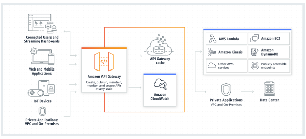

# AWS: API, Dynamo and Lambda

## Amazon API Gateway

Amazon API Gateway is a fully managed service that makes it easy for developers to create, publish, maintain, monitor, and secure APIs at any scale. APIs act as the "front door" for applications to access data, business logic, or functionality from your backend services. Using API Gateway, you can create RESTful APIs and WebSocket APIs that enable real-time two-way communication applications. API Gateway supports containerized and serverless workloads, as well as web applications.

API Gateway handles all the tasks involved in accepting and processing up to hundreds of thousands of concurrent API calls, including traffic management, CORS support, authorization and access control, throttling, monitoring, and API version management. API Gateway has no minimum fees or startup costs. You pay for the API calls you receive and the amount of data transferred out and, with the API Gateway tiered pricing model, you can reduce your cost as your API usage scales.

## API Types

1. RESTful APIs
2. WEBSOCKET APIs

## How API Gateway Works

## Benefits

- Efficient API development
- Performance at any scale
- Cost savings at scale
- Easy monitoring
- Flexible security controls
- RESTful API options

## DynamoDB

DynamoDB is a hosted NoSQL database offered by Amazon Web Services (AWS). It offers:

- reliable performance even as it scales;
- a managed experience, so you won't be SSH-ing into servers to upgrade the crypto libraries.
- a small, simple API allowing for simple key-value access as well as more advanced query patterns.

DynamoDB is a particularly good fit for the following use cases:

Applications with large amounts of data and strict latency requirements. As your amount of data scales, JOINs and advanced SQL operations can slow down your queries. With DynamoDB, your queries have predictable latency up to any size, including over 100 TBs!

Serverless applications using AWS Lambda. AWS Lambda provides auto-scaling, stateless, ephemeral compute in response to event triggers. DynamoDB is accessible via an HTTP API and performs authentication & authorization via IAM roles, making it a perfect fit for building Serverless applications.

Data sets with simple, known access patterns. If you're generating recommendations and serving them to users, DynamoDB's simple key-value access patterns make it a fast, reliable choice.

## Amazon DynamoDB

Amazon DynamoDB is a fully managed, serverless, key-value NoSQL database designed to run high-performance applications at any scale. DynamoDB offers built-in security, continuous backups, automated multi-Region replication, in-memory caching, and data export tools.

## Use cases

- Develop software applications
- Create media metadata stores
- Deliver seamless retail experiences
- Scale gaming platforms

## Dynamoose

Dynamoose is a modeling tool for Amazon's DynamoDB. Dynamoose is heavily inspired by Mongoose, which means if you are coming from Mongoose the syntax will be very familar.

## Key Features

- Type safety
- High level API
- Easy to use syntax
- Ability to transform data before saving or retrieving documents
- Strict data modeling (validation, required attributes, and more)
- Support for DynamoDB Transactions
- Powerful Conditional/Filtering Support
- Callback & Promise support
