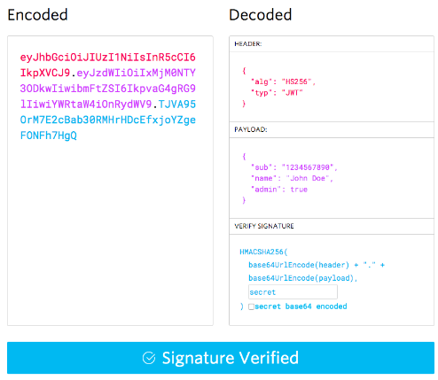

# Bearer Authorization

## What is JSON Web Token ?

- It's an open standard and this means anyone can use it.

- It's used to securly transfer information between any two bodies.

- It's digitally signed this means the information is verified and trusted.

### Compact

- can be send via URL, POST requset, HTTP header
- Fast Transmission

### Self-contained

- Contains information about the user
- Avoiding query the database more than once

## JWT is usefull in

- Authentication
- Information Exchange

## JWT Structure

- Header
  > contains: Algorithm, Type of JWT >>>> This JSON is `Base64Url` encoded to form this part
- Payload
  > contains: claims and it means the user details or additional metadata >>>> `Base64Url` encoded to form this part
  - Public claims
  - Private claims
- Signature
  > combine base64 header and base64 payload with secret and provide more security also combine with dot(.)

## How JWT work

.png>)
