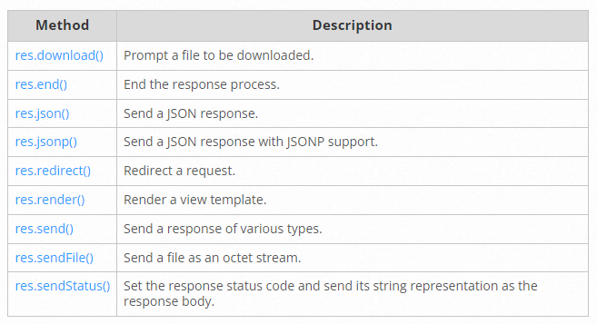

# Express REST API :

## ES6 Classes :

**A JavaScript class is not an object.**

**It is a template for JavaScript objects.**

## 1- Classes

Classes are a template for creating objects. They encapsulate data with code to work on that data. Classes in JS are built on prototypes but also have some syntax and semantics that are not shared with ES5 class-like semantics.

### Defining classes

Classes are in fact "special functions", and just as you can define function expressions and function declarations, the class syntax has two components: class expressions and class declarations.

### Class declarations

```js
class Rectangle {
  constructor(height, width) {
    this.height = height;
    this.width = width;
  }
}
```

### Hoisting

```js
class Rectangle {}

const p = new Rectangle();
```

```js
const p = new Rectangle(); // ReferenceError

class Rectangle {}
```

## Class expressions

```js
// unnamed
let Rectangle = class {
  constructor(height, width) {
    this.height = height;
    this.width = width;
  }
};
console.log(Rectangle.name);
// output: "Rectangle"

// named
let Rectangle = class Rectangle2 {
  constructor(height, width) {
    this.height = height;
    this.width = width;
  }
};
console.log(Rectangle.name);
// output: "Rectangle2"
```

### Class body and method definitions

The body of a class is the part that is in curly brackets {}. This is where you define class members, such as methods or constructor.

### Strict mode

The body of a class is executed in strict mode, i.e., code written here is subject to stricter syntax for increased performance, some otherwise silent errors will be thrown, and certain keywords are reserved for future versions of ECMAScript.

### Constructor

The constructor method is a special method for creating and initializing an object created with a class. There can only be one special method with the name "constructor" in a class. A SyntaxError will be thrown if the class contains more than one occurrence of a constructor method.

> A constructor can use the super keyword to call the constructor of the super class.

### Prototype methods

```js
class Rectangle {
  constructor(height, width) {
    this.height = height;
    this.width = width;
  }
  // Getter
  get area() {
    return this.calcArea();
  }
  // Method
  calcArea() {
    return this.height * this.width;
  }
}

const square = new Rectangle(10, 10);

console.log(square.area); // 100
```

## 2- Routing

Routing refers to how an application’s endpoints (URIs) respond to client requests.

### Route methods

```js
// GET method route
app.get('/', (req, res) => {
  res.send('GET request to the homepage');
});

// POST method route
app.post('/', (req, res) => {
  res.send('POST request to the homepage');
});

app.all('/secret', (req, res, next) => {
  console.log('Accessing the secret section ...');
  next(); // pass control to the next handler
});
```

### Route paths

Here are some examples of route paths based on strings.

This route path will match requests to the root route, /.

```js
app.get('/', (req, res) => {
  res.send('root');
});
```

This route path will match requests to /about.

```js
app.get('/about', (req, res) => {
  res.send('about');
});
```

This route path will match requests to /random.text.

```js
app.get('/random.text', (req, res) => {
  res.send('random.text');
});
```

Here are some examples of route paths based on string patterns.

This route path will match acd and abcd.

```js
app.get('/ab?cd', (req, res) => {
  res.send('ab?cd');
});
```

This route path will match abcd, abbcd, abbbcd, and so on.

```js
app.get('/ab+cd', (req, res) => {
  res.send('ab+cd');
});
```

This route path will match abcd, abxcd, abRANDOMcd, ab123cd, and so on.

```js
app.get('/ab*cd', (req, res) => {
  res.send('ab*cd');
});
```

This route path will match /abe and /abcde.

```js
app.get('/ab(cd)?e', (req, res) => {
  res.send('ab(cd)?e');
});
```

Examples of route paths based on regular expressions:

This route path will match anything with an “a” in it.

```js
app.get(/a/, (req, res) => {
  res.send('/a/');
});
```

This route path will match butterfly and dragonfly, but not butterflyman, dragonflyman, and so on.

```js
app.get(/.*fly$/, (req, res) => {
  res.send('/.*fly$/');
});
```

### Route parameters

Route parameters are named URL segments that are used to capture the values specified at their position in the URL. The captured values are populated in the req.params object, with the name of the route parameter specified in the path as their respective keys.

```js
Route path: /users/:userId/books/:bookId
Request URL: http://localhost:3000/users/34/books/8989
req.params: { "userId": "34", "bookId": "8989" }
```

To define routes with route parameters, simply specify the route parameters in the path of the route as shown below.

```js
app.get('/users/:userId/books/:bookId', (req, res) => {
  res.send(req.params);
});
```

> The name of route parameters must be made up of “word characters” ([A-Za-z0-9_]).

Since the hyphen (-) and the dot (.) are interpreted literally, they can be used along with route parameters for useful purposes.

```js
Route path: /flights/:from-:to
Request URL: http://localhost:3000/flights/LAX-SFO
req.params: { "from": "LAX", "to": "SFO" }
```

```js
Route path: /plantae/:genus.:species
Request URL: http://localhost:3000/plantae/Prunus.persica
req.params: { "genus": "Prunus", "species": "persica" }
```

To have more control over the exact string that can be matched by a route parameter, you can append a regular expression in parentheses (()):

```js
Route path: /user/:userId(\d+)
Request URL: http://localhost:3000/user/42
req.params: {"userId": "42"}
```

> Because the regular expression is usually part of a literal string, be sure to escape any \ characters with an additional backslash, for example \\d+.
> In Express 4.x, the character in regular expressions is not interpreted in the usual way. As a workaround, use {0,} instead of \_. This will likely be fixed in Express 5.

### Route handlers

A single callback function can handle a route. For example:

```js
app.get('/example/a', (req, res) => {
  res.send('Hello from A!');
});
```

More than one callback function can handle a route (make sure you specify the next object). For example:

```js
app.get(
  '/example/b',
  (req, res, next) => {
    console.log('the response will be sent by the next function ...');
    next();
  },
  (req, res) => {
    res.send('Hello from B!');
  }
);
```

An array of callback functions can handle a route. For example:

```js
const cb0 = function (req, res, next) {
  console.log('CB0');
  next();
};

const cb1 = function (req, res, next) {
  console.log('CB1');
  next();
};

const cb2 = function (req, res) {
  res.send('Hello from C!');
};

app.get('/example/c', [cb0, cb1, cb2]);
```

A combination of independent functions and arrays of functions can handle a route. For example:

```js
const cb0 = function (req, res, next) {
  console.log('CB0');
  next();
};

const cb1 = function (req, res, next) {
  console.log('CB1');
  next();
};

app.get(
  '/example/d',
  [cb0, cb1],
  (req, res, next) => {
    console.log('the response will be sent by the next function ...');
    next();
  },
  (req, res) => {
    res.send('Hello from D!');
  }
);
```

### Response methods



### express.Router

Create a router file named birds.js in the app directory, with the following content:

```js
const express = require('express');
const router = express.Router();

// middleware that is specific to this router
router.use((req, res, next) => {
  console.log('Time: ', Date.now());
  next();
});
// define the home page route
router.get('/', (req, res) => {
  res.send('Birds home page');
});
// define the about route
router.get('/about', (req, res) => {
  res.send('About birds');
});

module.exports = router;
```

Then, load the router module in the app:

```js
const birds = require('./birds');

// ...

app.use('/birds', birds);
```

The app will now be able to handle requests to /birds and /birds/about, as well as call the timeLog middleware function that is specific to the route.
