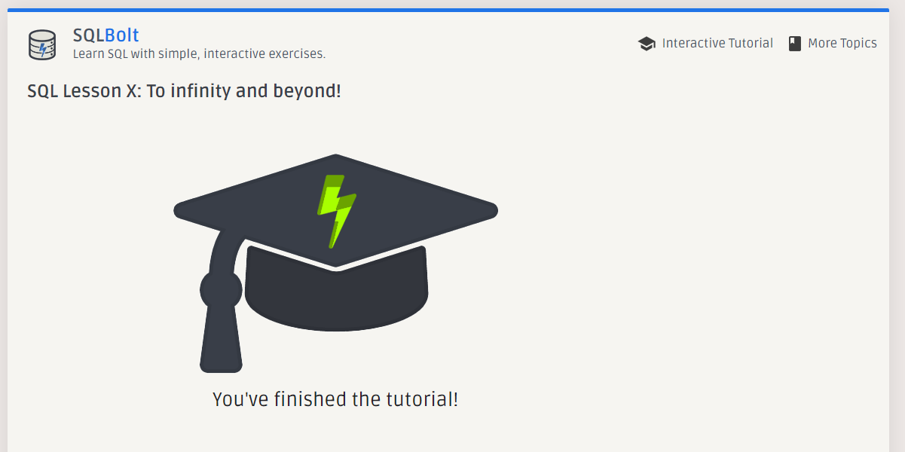

# Introduction to SQL

### SQL is stands for Structured Query Language and it's a search language used to manipulate a database like add, retrieve, update and delete data...etc.

### For retrieve the data we can use SELECT and the syntax will be like this :

To retrieve a Number:

```SQL
SELECT Number;
```

To retrieve a String:

```SQL
SELECT "String";
```

To do some Math:

```SQL
SELECT do some Math;
```

To get data from a specific table:

```sql
SELECT data FROM table_name;
```

TO get all data from a specific table:

```sql
SELECT * FROM table_name;
```

To get data from a specific table with specific condition:

```sql
SELECT data FROM table_name WHERE condition;
```

> you can use AND, OR and NOT for the collection

To get data by some specific order:

```sql
SELECT data FROM table_name ORDER BY the column you want;
```

> you can order the data ascending or descending by using ASC/DESC

To limit the number of results that are returned:

```sql
SELECT data FROM table_name LIMIT Number to limit;
```

To specify where to start returning data:

```sql
SELECT data FROM table_name OFFSET Number of rows to skip;
```

> Schema is used to describe a collection of tables and their relationships in your database.

## String operators and Patterns:

- LIKE : a string matches a pattern.

- ILIKE : case insensitive version of LIKE.

- SIMILAR TO : a string matches a regex pattern.

To join tables:

```sql
SELECT * FROM [table1] JOIN [table2] ON [table1.primary_key] = [table2.foreign_key];
```

## To add data you can use INSERT :

```SQL
INSERT INTO table_name (column1, column2, column3, ...)
VALUES (value1, value2, value3, ...);
```

## To update data you can use UPDATE :

```sql
UPDATE table_name
 SET column1 = value1, column2 = value2, ...
 WHERE condition;
```

## To delete data you can use DELETE :

```sql
DELETE FROM table_name WHERE condition;
```

Formatting Dates to Strings:

```sql
TO_CHAR([date type], [pattern])
```

Copy into a new pre-structured table:

```sql
CREATE TABLE [Table to copy To]
AS [Table to copy From]
WITH NO DATA;
```

- Note: “WITH NO DATA” specifies that the new table should only copy the table structure
  with no data.

Copy into pre-existing table:

```sql
INSERT INTO [Table to copy To]
SELECT [Columns to Copy]
FROM [Table to copy From]
WHERE [Optional Condition];
```

## Export to CSV with \copy:

For Client-Side Export:

```sql
\copy [Table/Query] to '[Relative Path/filename.csv]' csv header
```

For Server-Side Export:

```sql
COPY [Table/Query] to '[Absolute Path/filename.csv]' csv header;
```

> Comma Separated Value (CSV) files are a useful format for storing data.

> The location that psql is currently saving can be found by using the `\!pwd` command.

Generate a Series in PostgreSQL:

```sql
Postgresgenerate_series([start], [stop], [{optional}step/interval]);
```

> the interval, follows the format of [quantity] [type] [{optional} direction]

A shorthand notation:

```sql
P [Quantity] [date unit] ... T [quantity] [time unit] … ;
```

To create a copy of a database, run the following command in psql:

```sql
CREATE DATABASE [Database to create]
WITH TEMPLATE [Database to copy]
OWNER [Your username];
```

To Replace Nulls with 0s in SQL:

```SQL
UPDATE [table]
SET [column]=0
WHERE [column] IS NULL;
```

Importing from CSV in PSQL:

```SQL
COPY [Table Name](Optional Columns)
FROM '[Absolute Path to File]'
DELIMITER '[Delimiter Character]' CSV [HEADER];
```

## ALTER TABLE

```SQL
ALTER TABLE table_name
ADD COLUMN column_name VARCHAR;

ALTER TABLE table_name
DROP COLUMN column_name;
```

To change the datatype of a pre-existing column:

```sql
ALTER TABLE table_name
ALTER COLUMN belts
TYPE char USING belts::char;
```

Renaming and Changing Schemas:

```sql
ALTER TABLE table_name
RENAME TO whatever;
Or
ALTER TABLE table_name
RENAME COLUMN whatever TO anything;
```

## ALTER DATABASE

Name: The database can be renamed:

```sql
ALTER DATABASE [database name]
RENAME TO [new name];
```

Allow Connections:

```sql
ALTER DATABASE [database name]
WITH ALLOW_CONNECTIONS [true/false];
```

Connection Limit:

```sql
ALTER DATABASE [database name]
WITH CONNECTION_LIMIT [number of connections];
```

Template:

```sql
ALTER DATABASE [database name]
WITH IS_TEMPLATE [true/false];
```

Owner:

```sql
ALTER DATABASE [database name]
OWNER TO [username];
```

Tablespace:

```sql
ALTER DATABASE [database name]
SET TABLESPACE [new tablespace];
```

Configuration Parameters:

```sql
ALTER DATABASE [database name]
SET [configuration parameter] TO [value];

or

ALTER DATABASE [database name]
RESET [configuration parameter];

or

ALTER DATABASE [database name]
RESET ALL;
```

## Screenshot for the task


