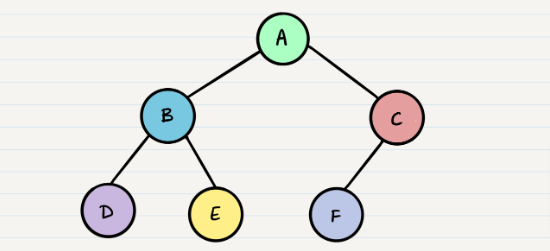
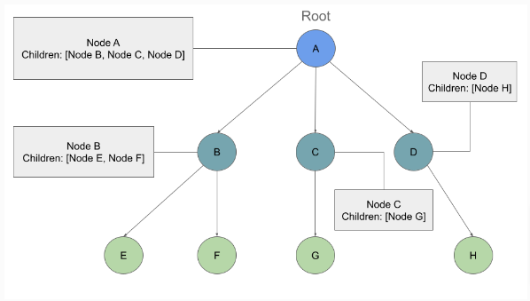

# Trees

- Node - A Tree node is a component which may contain its own values, and references to other nodes
- Root - The root is the node at the beginning of the tree
- K - A number that specifies the maximum number of children any node may have in a k-ary tree. In a binary tree, `k = 2`.
- Left - A reference to one child node, in a binary tree
- Right - A reference to the other child node, in a binary tree
- Edge - The edge in a tree is the link between a parent and child node
- Leaf - A leaf is a node that does not have any children
- Height - The height of a tree is the number of edges from the root to the furthest leaf

## Sample Tree


## Traversals

Traversing a tree allows us to search for a node, print out the contents of a tree, and much more! There are two categories of traversals when it comes to trees:

- Depth First
- Breadth First

## Depth First

Depth first traversal is where we prioritize going through the depth (height) of the tree first. There are multiple ways to carry out depth first traversal, and each method changes the order in which we search/print the `root`. Here are three methods for depth first traversal:

- Pre-order: `root >> left >> right`
- In-order: `left >> root >> right`
- Post-order: `left >> right >> root`

> Depth first call stack via recursion

Example:



our traversals would result in different paths:

- Pre-order: `A, B, D, E, C, F`
- In-order: `D, B, E, A, F, C`
- Post-order: `D, E, B, F, C, A`

> The most common way to traverse through a tree is to use recursion.

Pre-order

```js
ALGORITHM preOrder(root)
// INPUT <-- root node
// OUTPUT <-- pre-order output of tree node's values

  OUTPUT <-- root.value

  if root.left is not NULL
      preOrder(root.left)

  if root.right is not NULL
      preOrder(root.right)
```

In-order

```js
ALGORITHM inOrder(root)
// INPUT <-- root node
// OUTPUT <-- in-order output of tree node's values

    if root.left is not NULL
        inOrder(root.left)

    OUTPUT <-- root.value

    if root.right is not NULL
        inOrder(root.right)
```

Post-order

```js
ALGORITHM postOrder(root)
// INPUT <-- root node
// OUTPUT <-- post-order output of tree node's values

    if root.left is not NULL
        postOrder(root.left)

    if root.right is not NULL
        postOrder(root.right)

    OUTPUT <-- root.value
```

## Breadth First

Breadth first traversal iterates through the tree by going through each level of the tree node-by-node.

Our output using breadth first traversal is now by previous example:

- Output: `A, B, C, D, E, F`

> breadth first traversal uses a queue (instead of the call stack via recursion) to traverse the width/breadth of the tree.

```js
ALGORITHM breadthFirst(root)
// INPUT  <-- root node
// OUTPUT <-- front node of queue to console

  Queue breadth <-- new Queue()
  breadth.enqueue(root)

  while ! breadth.is_empty()
    node front = breadth.dequeue()
    OUTPUT <-- front.value

    if front.left is not NULL
      breadth.enqueue(front.left)

    if front.right is not NULL
      breadth.enqueue(front.right)
```

## Binary Tree Vs K-ary Trees

Trees can have any number of children per node, but Binary Trees restrict the number of children to two (hence our `left` and `right` children).

If Nodes are able have more than 2 child nodes, we call the tree that contains them a K-ary Tree. In this type of tree we use `K` to refer to the maximum number of children that each Node is able to have.

## Traversing a K-ary tree

Traversing a K-ary tree requires a similar approach to the breadth first traversal. We are still pushing nodes into a queue, but we are now moving down a list of children of length k, instead of checking for the presence of a left and a right child.



If we traversed this tree Breadth First we should see the output:

- Output: `A, B, C, D, E, F, G, H`

```js
ALGORITHM breadthFirst(root)
// INPUT  <-- root node
// OUTPUT <-- front node of queue to console

  Queue breadth <-- new Queue()
  breadth.enqueue(root)

  while ! breadth.is_empty()
    node front = breadth.dequeue()
    OUTPUT <-- front.value

    for child in front.children
        breadth.enqueue(child)
```

## Adding a node

Because there are no structural rules for where nodes are “supposed to go” in a binary tree, it really doesn’t matter where a new node gets placed.

One strategy for adding a new node to a binary tree is to fill all “child” spots from the top down. To do so, we would leverage the use of breadth first traversal. During the traversal, we find the first node that does not have all its children filled, and insert the new node as a child. We fill the child slots from left to right.

In the event you would like to have a node placed in a specific location, you need to reference both the new node to create, and the parent node which the child is attached to.

## Binary Search Trees

A Binary Search Tree (BST) is a type of tree that does have some structure attached to it. In a BST, nodes are organized in a manner where all values that are smaller than the `root` are placed to the `left`, and all values that are larger than the `root` are placed to the `right`.

> The best way to approach a BST search is with a while loop. We cycle through the while loop until we hit a leaf, or until we reach a match with what we’re searching for.

## Big O

- The Big O time complexity for inserting a new node is `O(n)`.
- Searching for a specific node will also be `O(n)`.
- The Big O space complexity for a node insertion using breadth first insertion will be `O(w)`, where `w` is the largest width of the tree.
- The Big O time complexity of a Binary Search Tree’s insertion and search operations is `O(h)`.
- The Big O space complexity of a BST search would be `O(1)`.

## reference

[Trees](https://codefellows.github.io/common_curriculum/data_structures_and_algorithms/Code_401/class-15/resources/Trees.html)
