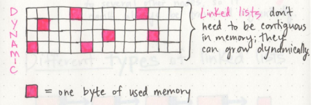
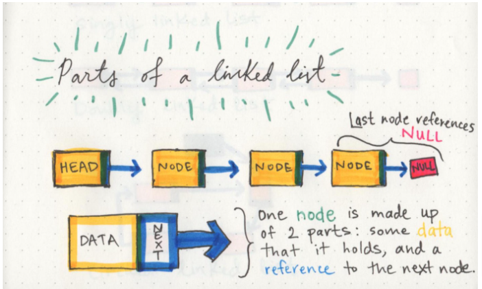
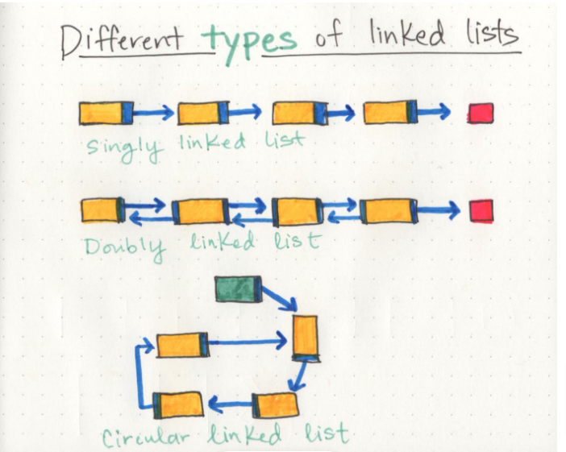
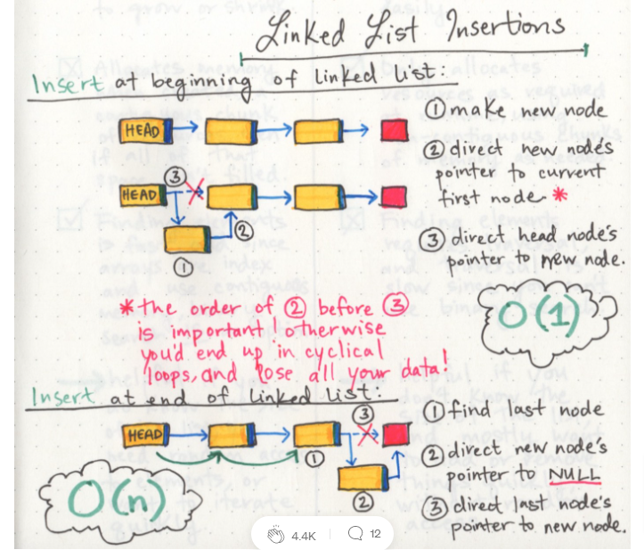
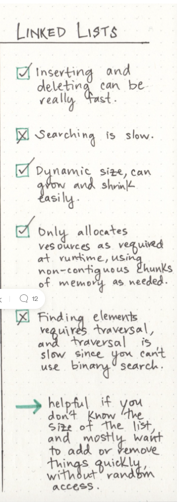

# Linked List

## What is a Linked List

A Linked List is a sequence of `Nodes` that are connected/linked to each other.

The most defining feature of a Linked List is that each `Node` references the next `Node` in the link.

Linked list is `linear data structures`, which means that there is a sequence and an order to how they are constructed and traversed.

## Memory management

Linked lists don’t need to take up a single block of memory; instead, the memory that they use can be scattered throughout.

Linked list is a dynamic data structure can shrink and grow in memory. It doesn’t need a set amount of memory to be allocated in order to exist, and its size and shape can change, and the amount of memory it needs can change as well.

## Parts of a linked list

A linked list can be small or huge, but no matter the size, the parts that make it up are actually fairly simple.

A linked list is made up of a series of `Nodes`, which are the elements of the list.

`Head` is The starting point of the list is a reference to the first node.

`Null` is The end of the list rather than a `Node`.

The `Node` has just two parts [data, reference to the next node] as a singly linked list and three parts [data, reference to the next node, reference to the previous node] as a doubly linked list or it can be circular linked list [it has a node that acts as the tail of the list].

## what is Big O?

`Big O Notation` is a way of evaluating the performance of an algorithm.

And it is a way to express the amount of time that a function, action, or algorithm takes to run based on how many elements we pass to that function.

> the two types of Big O equations to remember are O(1) and O(n).

`An O(1) function` takes constant time, which is to say that it doesn’t matter how many elements we have, or how huge our input is: it’ll always take the same amount of time and memory to run our algorithm.

`An O(n) function` is linear, which means that as our input grows the space and time that we need to run that algorithm grows linearly.

## rearrange our pointers.

To insert a `Node` at the beginning.

- First, we find the head node of the linked list.

- Next, we’ll make our new node, and set its pointer to the current first node of the list.

- Lastly, we rearrange our head node’s pointer to point at our new node.

> If we accidentally end up doing step 3 before step 2, we end up in a bit of a mess.

To insert a `Node` at the beginning.

- Find the node we want to change the pointer of (in this case, the last node).

- Create the new node we want to insert and set its pointer (in this case, to null).

- Direct the preceding node’s pointer to our new node.

## Properties of the Linked List

## Summary

A linked list is a sequence of data structures, which are connected together via links.

A linked list is a sequence of links that contain items. Each link contains a connection to another link.

A linked list is the second most-used data structure after an array.
