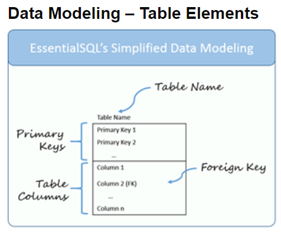
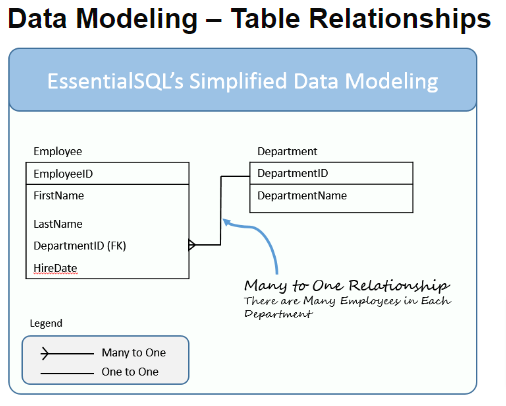
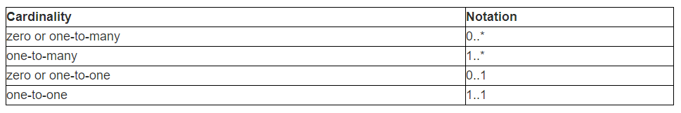

# SQL vs NoSQL

The high level difference between SQL and NoSQL.

1. ### First difference

   - SQL databases are primarily called as Relational Databases (RDBMS).

   - NoSQL database are primarily called as non-relational or distributed database.

2. ### Second difference

   - SQL databases are table based databases.

   - NoSQL databases are document based, key-value pairs, graph databases or wide-column stores.
     > NoSQL databases do not have standard schema definitions.

3. ### Third difference

   - SQL databases have predefined schema.

   - NoSQL databases have dynamic schema for unstructured data.

4. ### Fourth difference

   - SQL databases are vertically scalable.

     > SQL databases are scaled by increasing the horse-power of the hardware.

   - NoSQL databases are horizontally scalable.
     > NoSQL databases are scaled by increasing the databases servers in the pool of resources to reduce the load.

5. ### Fifth difference

   - SQL databases uses SQL ( structured query language ) for defining and manipulating the data.

   - NoSQL database, queries are focused on collection of documents.

     > Also called as UnQL (Unstructured Query Language).
     > The syntax of using UnQL varies from database to database.

6. ### Sixth difference

   - SQL database examples: MySql, Oracle, Sqlite, Postgres and MS-SQL.

   - NoSQL database examples: MongoDB, BigTable, Redis, RavenDb, Cassandra, Hbase, Neo4j and CouchDb.

7. ### For complex queries

   - SQL databases are good fit for the complex query.
   - NoSQL databases are not good fit for complex queries.

8. ### For the type of data to be stored

   - SQL databases are not best fit for hierarchical data storage.
   - NoSQL database fits better for the hierarchical data storage.

9. ### For scalability

   - SQL databases are vertically scalable.
     > You can manage increasing load by increasing the CPU, RAM, SSD, etc, on a single server.
   - NoSQL databases are horizontally scalable.
     > You can just add few more servers easily in your NoSQL database infrastructure to handle the large traffic.

10. ### For support

    - Excellent support are available for all SQL database from their vendors.
    - For some NoSQL database you still have to rely on community support, and only limited outside experts are available for you to setup and deploy your large scale NoSQL deployments.

11. ### For properties

    - SQL databases emphasizes on ACID properties ( Atomicity, Consistency, Isolation and Durability).
    - NoSQL database follows the Brewers CAP theorem ( Consistency, Availability and Partition tolerance ).

12. ### For DB types

    - we can classify SQL databases as either open-source or close-sourced from commercial vendors.
    - NoSQL databases can be classified on the basis of way of storing data as graph databases.

## SQL Database Examples

    1. MySQL Community Edition
    2. MS-SQL Server Express Edition
    3. Oracle Express Edition

## NoSQL Database Examples

    1. MongoDB
    2. CouchDB
    3. Redis

## Table Elements

### The Table Name

which is located at the top of the table.

### The Primary Keys

Remember the primary keys uniquely identify each row in a table.

A table typically has one primary key, but can have more. When the key has more than one column, it is called a `compound key`.

### Table Columns

There can be one or more table columns.

To keep the diagrams simple, I don’t show the data types.

I may introduce those later when we focus on more comprehensive modeling.

### Foreign Key

This is a column or set of columns which match a primary key in another table.

## Table Relationships

## Type of Relations

