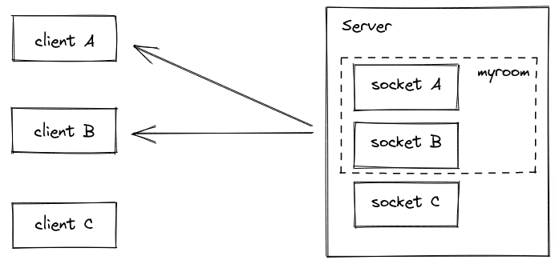
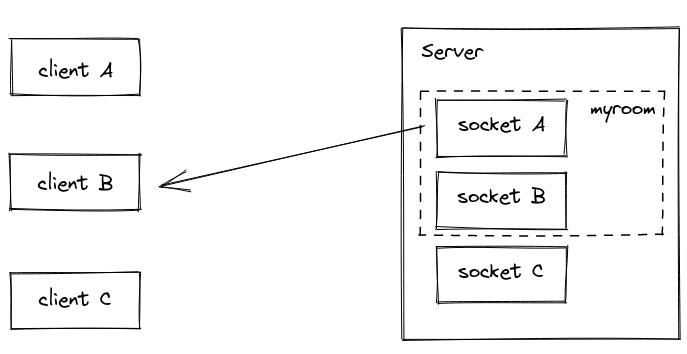
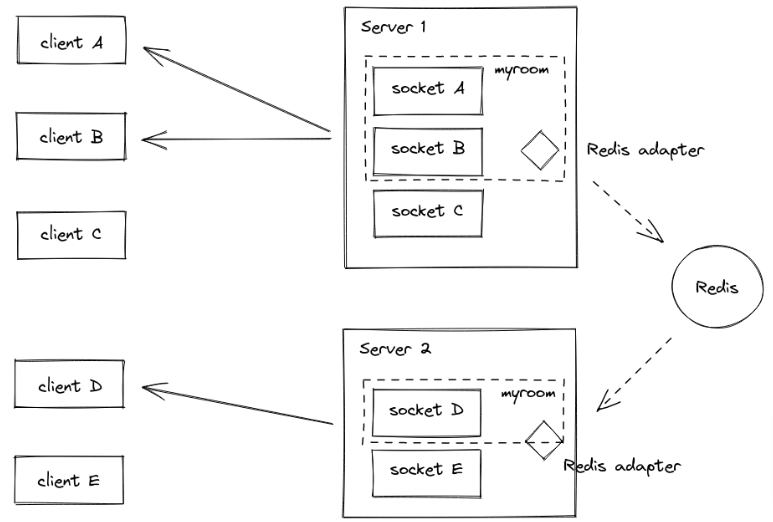
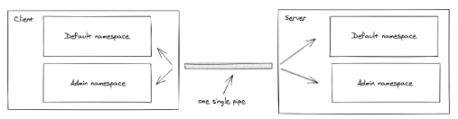

# Chat Application

## Introduction

Sockets have traditionally been the solution around which most real-time chat systems are architected, providing a bi-directional communication channel between a client and a server.

This means that the server can push messages to clients. Whenever you write a chat message, the idea is that the server will get it and push it to all other connected clients.

## Integrating Socket.IO

Socket.IO is composed of two parts:

A server that integrates with (or mounts on) the Node.JS HTTP Server `socket.io`.

A client library that loads on the browser side `socket.io-client`.

you can when the user is connected or disconnected

```js
io.on('connection', (socket) => {
  console.log('a user connected');
  socket.on('disconnect', () => {
    console.log('user disconnected');
  });
});
```

## Emitting events

The main idea behind Socket.IO is that you can send and receive any events you want, with any data you want. Any objects that can be encoded as JSON will do, and binary data is supported too.

## Broadcasting

If you want to send a message to everyone except for a certain emitting socket, we have the broadcast flag for emitting from that socket:

```js
io.on('connection', (socket) => {
  socket.broadcast.emit('hi');
});
```

In this case, for the sake of simplicity we’ll send the message to everyone, including the sender.

```js
io.on('connection', (socket) => {
  socket.on('chat message', (msg) => {
    io.emit('chat message', msg);
  });
});
```

## Reference for the chat app

[Chat Application](https://github.com/socketio/chat-example.git)

## Rooms

A room is an arbitrary channel that sockets can join and leave. It can be used to broadcast events to a subset of clients:



> Please note that rooms are a server-only concept (i.e. the client does not have access to the list of rooms it has joined).

## Joining and leaving

```js
io.on('connection', (socket) => {
  socket.join('some room');
});
```

And then simply use to or in (they are the same) when broadcasting or emitting:

```js
io.to('some room').emit('some event');
```

You can emit to several rooms at the same time:

```js
io.to('room1').to('room2').to('room3').emit('some event');
```

You can also broadcast to a room from a given socket:

```js
io.on('connection', (socket) => {
  socket.to('some room').emit('some event');
});
```

In that case, every socket in the room excluding the sender will get the event.



> To leave a channel you call leave in the same fashion as join.

## Default room

Each Socket in Socket.IO is identified by a random, unguessable, unique identifier Socket#id. For your convenience, each socket automatically joins a room identified by its own id.

```js
io.on('connection', (socket) => {
  socket.on('private message', (anotherSocketId, msg) => {
    socket.to(anotherSocketId).emit('private message', socket.id, msg);
  });
});
```

## Sample use cases

broadcast data to each device / tab of a given user

```js
io.on('connection', async (socket) => {
  const userId = await fetchUserId(socket);

  socket.join(userId);

  // and then later
  io.to(userId).emit('hi');
});
```

send notifications about a given entity

```js
io.on('connection', async (socket) => {
  const projects = await fetchProjects(socket);

  projects.forEach((project) => socket.join('project:' + project.id));

  // and then later
  io.to('project:4321').emit('project updated');
});
```

## Disconnection

Upon disconnection, sockets leave all the channels they were part of automatically, and no special teardown is needed on your part.

You can fetch the rooms the Socket was in by listening to the disconnecting event:

```js
io.on('connection', (socket) => {
  socket.on('disconnecting', () => {
    console.log(socket.rooms); // the Set contains at least the socket ID
  });

  socket.on('disconnect', () => {
    // socket.rooms.size === 0
  });
});
```

## Multiple Socket.IO servers

Like global broadcasting, broadcasting to rooms also works with multiple Socket.IO servers.

You just need to replace the default Adapter by the Redis Adapter.



## Implementation details

The "room" feature is implemented by what we call an Adapter. This Adapter is a server-side component which is responsible for:

- storing the relationships between the Socket instances and the rooms
- broadcasting events to all (or a subset of) clients

Basically, it consists in two `ES6 Maps`:

```js
sids: Map<SocketId, Set<Room>>
rooms: Map<Room, Set<SocketId>>
Calling socket.join("the-room") will result in:
```

in the `̀sids` Map, adding "the-room" to the Set identified by the socket ID
in the `rooms` Map, adding the socket ID in the Set identified by the string "the-room"

Those two maps are then used when broadcasting:

- a broadcast to all sockets (`io.emit()`) loops through the `sids` Map, and send the packet to all sockets
- a broadcast to a given room (`io.to("room21").emit()`) loops through the Set in the `rooms` Map, and sends the packet to all matching sockets

You can access those objects with:

```js
// main namespace
const rooms = io.of('/').adapter.rooms;
const sids = io.of('/').adapter.sids;

// custom namespace
const rooms = io.of('/my-namespace').adapter.rooms;
const sids = io.of('/my-namespace').adapter.sids;
```

Notes:

those objects are not meant to be directly modified, you should always use `socket.join(...)` and `socket.leave(...)` instead.
in a `multi-server` setup, the `rooms` and `sids` objects are not shared between the Socket.IO servers (a room may only "exist" on one server and not on another).

## Room events

Starting with socket.io@3.1.0, the underlying Adapter will emit the following events:

- `create-room` (argument: room)
- `delete-room` (argument: room)
- `join-room` (argument: room, id)
- `leave-room` (argument: room, id)

Example:

```js
io.of('/').adapter.on('create-room', (room) => {
  console.log(`room ${room} was created`);
});

io.of('/').adapter.on('join-room', (room, id) => {
  console.log(`socket ${id} has joined room ${room}`);
});
```

## Namespaces

A Namespace is a communication channel that allows you to split the logic of your application over a single shared connection (also called "multiplexing").



Each namespace has its own:

### event handlers

```js
io.of('/orders').on('connection', (socket) => {
  socket.on('order:list', () => {});
  socket.on('order:create', () => {});
});

io.of('/users').on('connection', (socket) => {
  socket.on('user:list', () => {});
});
```

### rooms

```js
const orderNamespace = io.of('/orders');

orderNamespace.on('connection', (socket) => {
  socket.join('room1');
  orderNamespace.to('room1').emit('hello');
});

const userNamespace = io.of('/users');

userNamespace.on('connection', (socket) => {
  socket.join('room1'); // distinct from the room in the "orders" namespace
  userNamespace.to('room1').emit('holà');
});
```

### middleware

```js
const orderNamespace = io.of('/orders');

orderNamespace.use((socket, next) => {
  // ensure the socket has access to the "orders" namespace, and then
  next();
});

const userNamespace = io.of('/users');

userNamespace.use((socket, next) => {
  // ensure the socket has access to the "users" namespace, and then
  next();
});
```

## References

[Rooms](https://socket.io/docs/v4/rooms)

[Namespaces](https://canvas.instructure.com/courses/4839234/discussion_topics/14886086)
