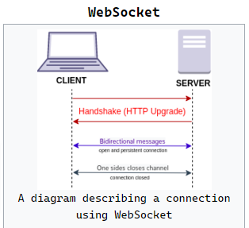
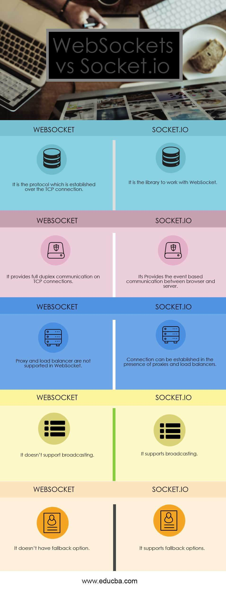

# WebSocket

WebSocket is a computer communications protocol, providing full-duplex communication channels over a single TCP connection.



Example:

```js
// Creates new WebSocket object with a wss URI as the parameter
const socket = new WebSocket('wss://game.example.com/ws/updates');

// Fired when a connection with a WebSocket is opened
socket.onopen = function () {
  setInterval(function () {
    if (socket.bufferedAmount == 0) socket.send(getUpdateData());
  }, 50);
};

// Fired when data is received through a WebSocket
socket.onmessage = function (event) {
  handleUpdateData(event.data);
};

// Fired when a connection with a WebSocket is closed
socket.onclose = function (event) {
  onSocketClose(event);
};

// Fired when a connection with a WebSocket has been closed because of an error
socket.onerror = function (event) {
  onSocketError(event);
};
```

## Protocol handshake

Client request

```js
GET /chat HTTP/1.1
Host: server.example.com
Upgrade: websocket
Connection: Upgrade
Sec-WebSocket-Key: x3JJHMbDL1EzLkh9GBhXDw==
Sec-WebSocket-Protocol: chat, superchat
Sec-WebSocket-Version: 13
Origin: http://example.com
```

Server response

```js
HTTP/1.1 101 Switching Protocols
Upgrade: websocket
Connection: Upgrade
Sec-WebSocket-Accept: HSmrc0sMlYUkAGmm5OPpG2HaGWk=
Sec-WebSocket-Protocol: chat
```

> The handshake starts with an HTTP request/response, allowing servers to handle HTTP connections as well as WebSocket connections on the same port. Once the connection is established, communication switches to a bidirectional binary protocol which does not conform to the HTTP protocol.

## Socket.IO

Socket.IO is a JavaScript library for real-time web applications. It enables real-time, bi-directional communication between web clients and servers. It has two parts − a client-side library that runs in the browser, and a server-side library for node.js. Both components have an identical API.

## Real-time Applications

A real-time application (RTA) is an application that functions within a period that the user senses as immediate or current.

Examples:

- Instant messengers − Chat apps like Whatsapp, Facebook Messenger, etc. You need not refresh your app/website to receive new messages.

- Push Notifications − When someone tags you in a picture on Facebook, you receive a notification instantly.

- Collaboration Applications − Apps like google docs, which allow multiple people to update same documents simultaneously and apply changes to all people's instances.

- Online Gaming − Games like Counter Strike, Call of Duty, etc., are also some examples of real-time applications.

> We will be using express to build the web server that Socket.IO will work with. Any other node-server-side framework or even node HTTP server can be used. However, ExpressJS makes it easy to define routes and other things.

```js
var app = require('express')();
var http = require('http').Server(app);
var io = require('socket.io')(http);

app.get('/', function (req, res) {
  res.sendFile('E:/test/index.html');
});

//Whenever someone connects this gets executed
io.on('connection', function (socket) {
  console.log('A user connected');

  //Whenever someone disconnects this piece of code executed
  socket.on('disconnect', function () {
    console.log('A user disconnected');
  });
});
http.listen(3000, function () {
  console.log('listening on *:3000');
});
```

## Reserved events server side

- Connect
- Message
- Disconnect
- Reconnect
- Ping
- Join and
- Leave

## Reserved events client-side

- Connect
- Connect_error
- Connect_timeout
- Reconnect, etc.

```js
In the Hello World example, we used the connection and disconnection events to
log when a user connected and left. Now we will be using the message event to
pass message from the server to the client. To do this, modify the io.on
('connection', function(socket)) as shown below –var app =
require('express')();
var http = require('http').Server(app);
var io = require('socket.io')(http);

app.get('/', function(req, res){
   res.sendFile('E:/test/index.html');
});

io.on('connection', function(socket){
   console.log('A user connected');

   // Send a message after a timeout of 4seconds
   setTimeout(function(){
      socket.send('Sent a message 4seconds after connection!');
   }, 4000);
   socket.on('disconnect', function () {
      console.log('A user disconnected');
   });
});
http.listen(3000, function(){
   console.log('listening on *:3000');
});
```

```js
var app = require('express')();
var http = require('http').Server(app);
var io = require('socket.io')(http);

app.get('/', function (req, res) {
  res.sendFile('E:/test/index.html');
});

io.on('connection', function (socket) {
  console.log('A user connected');
  // Send a message when
  setTimeout(function () {
    // Sending an object when emmiting an event
    socket.emit('testerEvent', {
      description: 'A custom event named testerEvent!',
    });
  }, 4000);
  socket.on('disconnect', function () {
    console.log('A user disconnected');
  });
});
http.listen(3000, function () {
  console.log('listening on localhost:3000');
});
```

## Difference Between WebSocket and Socket.io


