# Stacks and Queues

## Stacks

A stack is a data structure that consists of `Nodes`. Each `Node` references the next Node in the stack, but does not reference its previous.

Stacks follow these concepts:

`FILO`

First In Last Out

> This means that the first item added in the stack will be the last item popped out of the stack.

`LIFO`

Last In First Out

> This means that the last item added to the stack will be the first item popped out of the stack.

## Stack Visualization

The stack looks like.

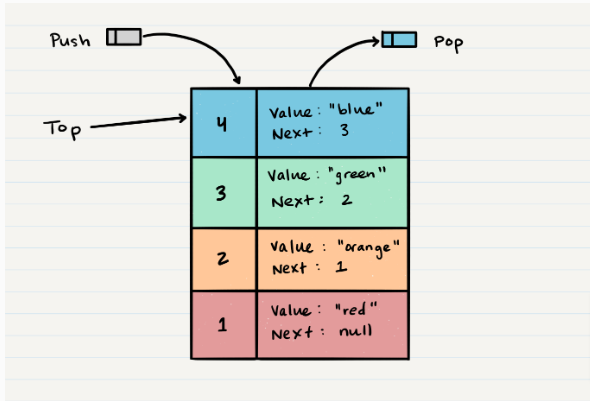

## Push O(1)

First, you should have the Node that you want to add. Here is an example of a Node that we want to add to the stack.

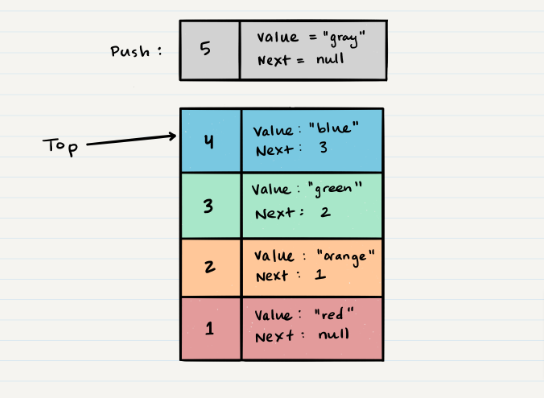

Next, you need to assign the `next` property of `Node 5` to reference the same Node that `top` is referencing: `Node 4`

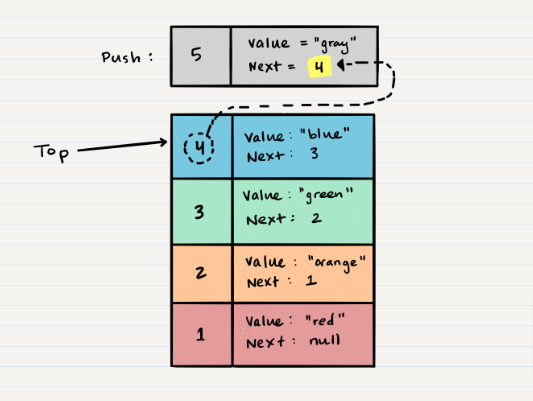

Your new Node is added to your stack, but there is no indication that it is the first Node in the stack. To make this happen, you have to re-assign our reference `top` to the newly added Node, `Node 5`

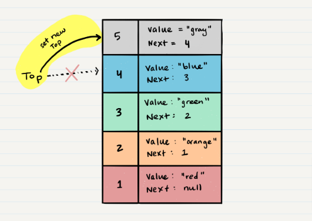

> You completed a successful push of Node 5 onto the stack.

The pseudocode to `push`

```js
// INPUT <-- value to add, wrapped in Node internally
// OUTPUT <-- none
node = new Node(value);
node.next < --Top;
top < --Node;
```

## Pop O(1)

Let’s try and `pop` off `Node 5` from the stack. Here is a visual of the current state of our stack:

> you would check `isEmpty` before conducting a `pop`. This will ensure that an exception is not raised. Alternately, you can wrap the call in a try/catch block.

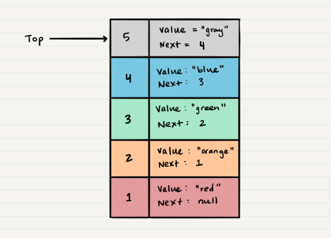

The first step of removing `Node 5` from the stack is to create a reference named `temp` that points to the same Node that `top` points to.

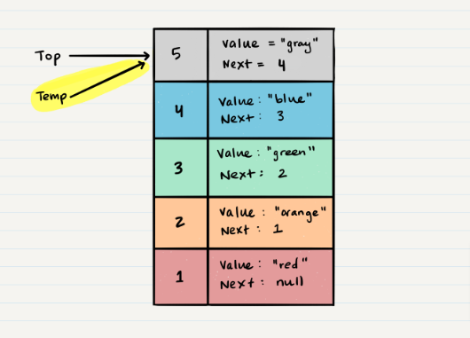

Once you have created the new reference type, you now need to re-assign `top` to the value that the `next` property is referencing. In our visual, we can see that the `next` property is pointing to `Node 4`. We will re-assign `top` to be `Node 4`.

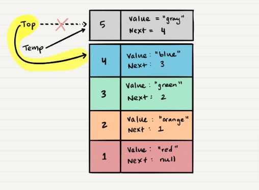

We can now remove `Node 5` safely without it affecting the rest of the stack. Before we do that though you may want to make sure that you clear out the `next` property in your current `temp` reference. This will ensure that no further references to `Node 4` are floating around the heap. This will allow our garbage collector to cleanly and safely dispose of the Nodes correctly.

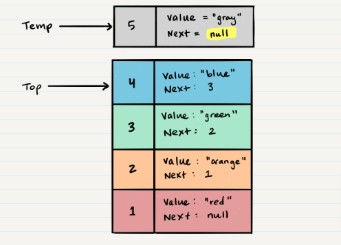

> we return the value of the temp Node that was just popped off.

The pseudocode to `pop`

```js
// INPUT <-- No input
// OUTPUT <-- value of top Node in stack
// EXCEPTION if stack is empty

   Node temp <-- top
   top <-- top.next
   temp.next <-- null
   return temp.value
```

## Peek O(1)

You will only be inspecting the `top` Node of the stack.

> you would check `isEmpty` before conducting a `peek`.

```js
// INPUT <-- none
// OUTPUT <-- value of top Node in stack
// EXCEPTION if stack is empty

return top.value;
```

## IsEmpty O(1)

```js
ALGORITHM isEmpty()
// INPUT <-- none
// OUTPUT <-- boolean

return top = NULL
```

## Queue

Common terminology for a queue is:

1. Enqueue - Nodes or items that are added to the queue.

2. Dequeue - Nodes or items that are removed from the queue.

   > If called when the queue is empty an exception will be raised.

3. Front - This is the front/first Node of the queue.

4. Rear - This is the rear/last Node of the queue.

5. Peek - When you `peek` you will view the value of the `front` Node in the queue.

   > If called when the queue is empty an exception will be raised.

6. IsEmpty - returns true when queue is empty otherwise returns false.

Queues follow these concepts:

`FIFO`

First In First Out

> This means that the first item in the queue will be the first item out of the queue.

`LILO`

Last In Last Out

> This means that the last item in the queue will be the last item out of the queue.

## Queue Visualization

Here is what a `Queue` looks like:

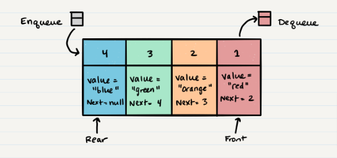

## Enqueue O(1)

Let’s walk through the process of adding a Node to a queue:

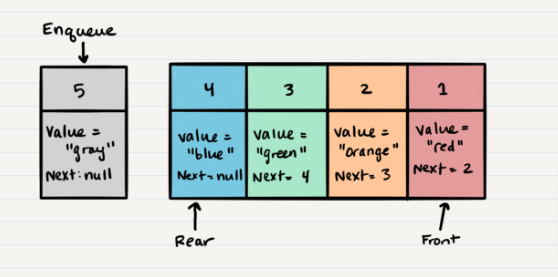

First, we should change the `next` property of `Node 4` to point to the Node we are adding. In our case with the visual below, we will be re-assigning `Node 4`’s `.next` to `Node 5`. The only way we have access to `Node 4` is through our reference `rear`. Following the rules of reference types, this means that we must change `rear.next` to `Node 5`.

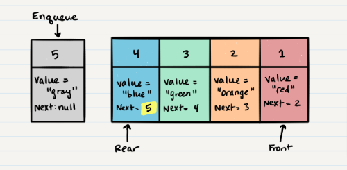

After we have set the `next` property, we can re-assign the `rear` reference to point to `Node 5`. By doing this, it allows us to keep a reference of where the `rear` is, and we can continue to `enqueue` Nodes into the queue as needed.

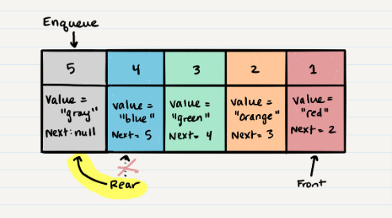

You have just successfully added a Node to a queue by activating the `enqueue` action.

The pseudocode to `enqueue`

```js
// INPUT <-- value to add to queue (will be wrapped in Node internally)
// OUTPUT <-- none
node = new Node(value);
rear.next < --node;
rear < --node;
```

## Dequeue O(1)

The first thing you want to do is create a temporary reference type named `temp` and have it point to the same Node that `front` is pointing too. This means that `temp` will point to `Node 1`.

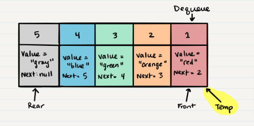

Next, you want to re-assign `front` to the `next` value that the Node `front` is referencing. In our visual, this would be `Node 2`.

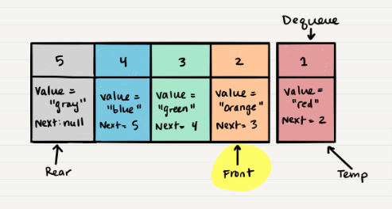

Now that we have moved `front` to the second Node in line, we can next re-assign the `next` property on the `temp` Node to null. We do this because we want to make sure that all the proper Nodes clear any unnecessary references for the garbage collector to come in later and clean up.


Finally, we return the value of the temp Node that was just removed.

> You have just successfully completed a dequeue action on a queue!

The pseudocode to `dequeue`

```js
// INPUT <-- none
// OUTPUT <-- value of the removed Node
// EXCEPTION if queue is empty

   Node temp <-- front
   front <-- front.next
   temp.next <-- null

   return temp.value
```

## Peek for queue O(1)

You will only be inspecting the front Node of the queue.

> You want to check isEmpty before conducting a peek.

The pseudocode to `peek`

```js
// INPUT <-- none
// OUTPUT <-- value of the front Node in Queue
// EXCEPTION if Queue is empty

return front.value;
```

## IsEmpty for queue O(1)

The pseudocode to `isEmpty`

```js
// INPUT <-- none
// OUTPUT <-- boolean

return (front = NULL);
```
